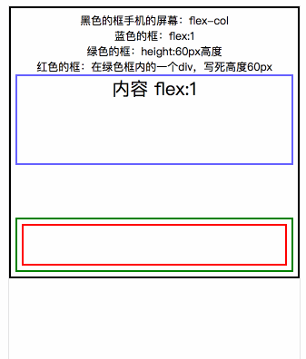

# Flex运用页面基本框架

## 例子内用到的样式表
```
.flex-col{
	display: flex;
	lex-direction: column;
}
.flex-row{
	display: flex;
	lex-direction: row;
}
```

### flex:1 自动平均分配空间的探索

```
<!--将box设置为竖向flex布局，里面元素flex:1平均分布-->
<box class="flex-col" style="width:100%;height:100%;">  
  <section style="flex:1"></section>
  <!--期望footer为一个固定80高度的容器，section则占用剩余部分全部高度-->  
  <footer style="height:80px"></footer>
</box>
```
然后我们开始变更 `section` 里面的内容，不断的增加内容的height值结果如下

  

本来我们代码的期望是`footer`保持`height:80px`高度不变，而现在`footer`被压缩了

解决方法有2种：
```
<box class="flex flex-col" style="width:100%;height:100%;">
    <section style="flex:1"></section>
    <footer>
    	<div style="height:80px"></div>
    </footer>
</box>
```
或者
```
<box class="flex flex-col" style="width:100%;height:auto;">
    <section style="flex:1"></section>
    <footer>
    </footer>
</box>
```

再来看一下结果



总结：
* 在使用flex:1时，`<box>`高度为固定值时，则会将`<section>`的高度去除后，将剩余高度分配给`<footer>`覆盖了`<footer>`原本设置的高度，在`<footer>`内部定义的dom设置高度，可以强行撑开`<footer>`
* 而`<box>`为auto时，因为高度空间有无限的高，所以`<section>`会根据自己内容而变更自身高度，不影响`footer`的高度。


