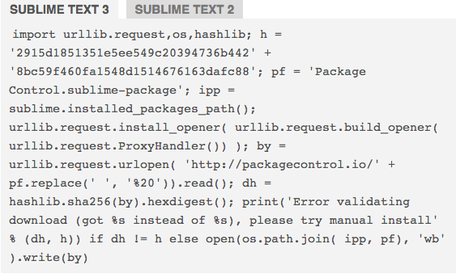
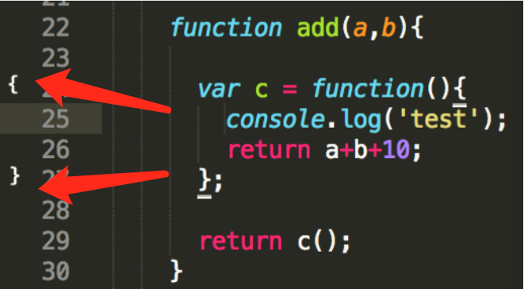

[TOC]

## Sublime使用帮助

### 下载地址  
`http://www.sublimetext.com/` 完全免费

### 插件安装  
* 安装 package control
* 安装方式可参考： `https://packagecontrol.io/installation`
* 按 `ctrl + ~` 然后将以上网站内的代码（import....)贴到命令行内执行
* 
  * `command + shift + P` 打开插件控制中心
  * 输入 `install package` 然后 `回车` 进入了插件中心
  * 输入需要安装的插件的名字（或者关键字），选中需要的插件 `回车`
  * sublime左下角会有安装进度，安装完成后会恢复原来的样子

### 插件介绍
* BracketHighlighter : 解决很多代码层叠的情况下快速定位代码属于哪个代码块，安装后鼠标点到的 JS/HTML/CSS 任何部分，会在左侧行数提示这里显示该代码属于哪个代码块内。
        * 
* All Autocomplete : 负责补全CSS
* SublimeCodeIntel ：全功能代码补全（HTML/JS）
* DocBlockr :自动生成注释的插件，当输入` /** ` `回车` 后会自动生成注释片段
        * 
* Autoprefixer : CSS自动补全兼容前缀（一般不使用）
* HTML-CSS-JS Prettify: 格式化代码，安装后选中需要格式化的代码段或者全选，然后按`command + shift + H` 就可以格式化代码。
* AutoFileName : 在输入文件路径的时候，会出现补全提示。
        * 
* sublimeLinter :代码检错工具，安装方法如下：
	*   
	* 1、安装 SublimeLinter
	* 2、安装 SublimeLinter-jshint
	* 3、打开mac终端安装jshint，npm install jshint -g
	* 然后编辑区鼠标右键里有个 SublimeLinter - LintMode -设置为save only

    * Markdown Preview : 用于在浏览器内预览编辑的md文件
        * 编辑MD文件需要预览时，按 `command + shift + P` 然后输入 `preview in browser` `回车` 就会在浏览器中打开当前编辑的文档了
        * 当文档修改后，只需要在浏览器内刷新一下就行啦
		
### 插件卸载
* `command + shift + P` 打开插件控制中心
* 输入 `remove package` 然后 `回车`
* 选择需要卸载的插件后 `回车`

### 快捷键
* ctrl+shift+w ： 在选中的文本两端增加标签
* 
	  